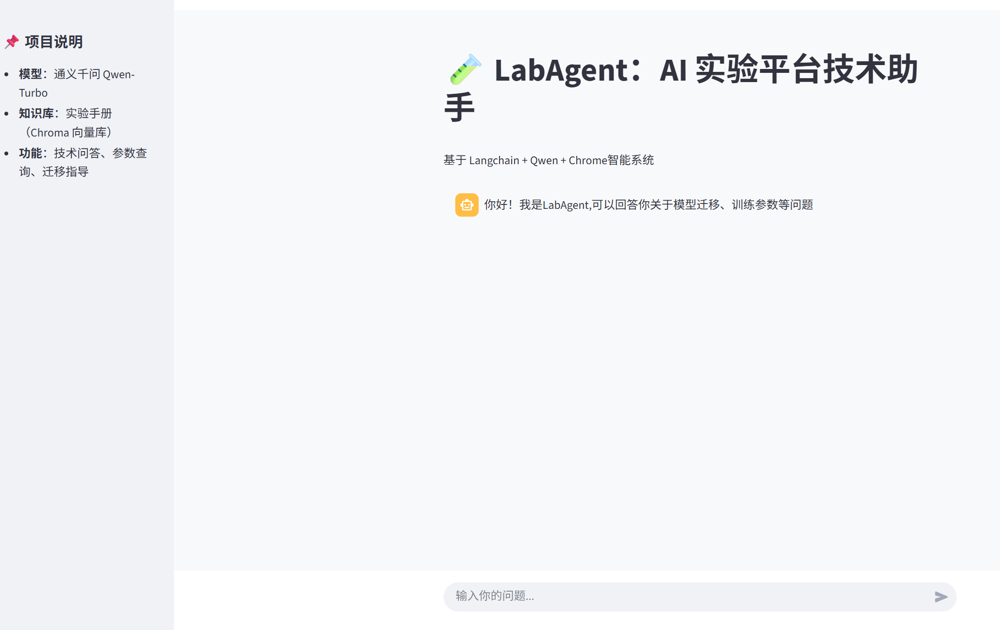

# LabAgent: An LLM-Powered Research Assistant

A RAG-based agent that answers questions about AI experiment manuals using LangChain and Zephyr-7B.

## Features
- Document ingestion with Chroma
- Retrieval-Augmented Generation (RAG)
- Streamlit web interface
- Built on real internship experience

## Tech Stack
- LangChain
- HuggingFace Transformers
- Chroma DB
- Streamlit
- LoRA (in progress)

## Demo
